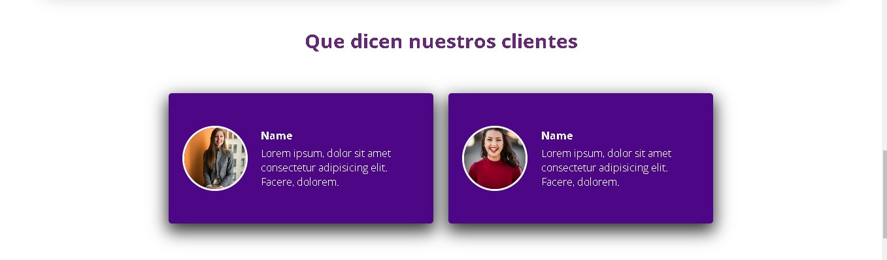

<h3>website-responsive</h3>

<h3>Link Deployment</h3>

https://website-responsive-html.netlify.app/

  

<h4>resources</h4>

<!-- wave -->
`https://smooth.ie/blogs/news/svg-wavey-transitions-between-sections`

<!-- ilustraciones -->
`https://iconos8.es/illustrations`

<!-- imagenes -->
`https://unsplash.com/es`

<!-- google fonts -->
`https://fonts.google.com/`

<!-- Gradiantes -->
`https://uigradients.com/#SeaBlue`